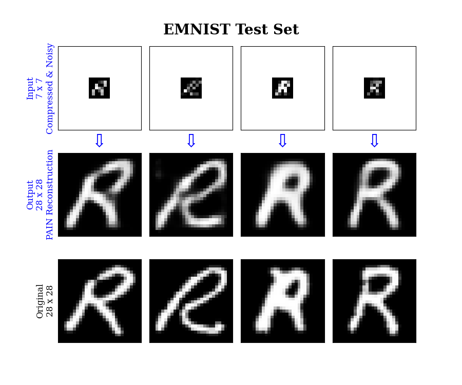

# DeepLearning for low-resolution photon-limited imaging
Code implementing the architectures in IEEE
publication: <a href="https://ieeexplore.ieee.org/abstract/document/8682767">Deep Neural Networks for Low-resolution Photon-limited Imaging</a>

<strong>Jupyter Notebooks:</strong>
<ul>
  <li><b><em>pain_tf.ipynb</em></b>: PAIN architecture in tensorflow applied to MNIST numbers </li>
  <li><b><em>pics_tf.ipynb</em></b>: PICS architecture in tensorflow applied to  MNIST numbers </li>
  <li><b><em>sda_tf.ipynb</em></b>: SDA architecture in tensorflow applied to  MNIST numbers </li>
  <li><b><em>pain_emnist_tf.ipynb</em></b>: PAIN architecture in tensorflow appied to EMNIST letters</li>
</ul>
